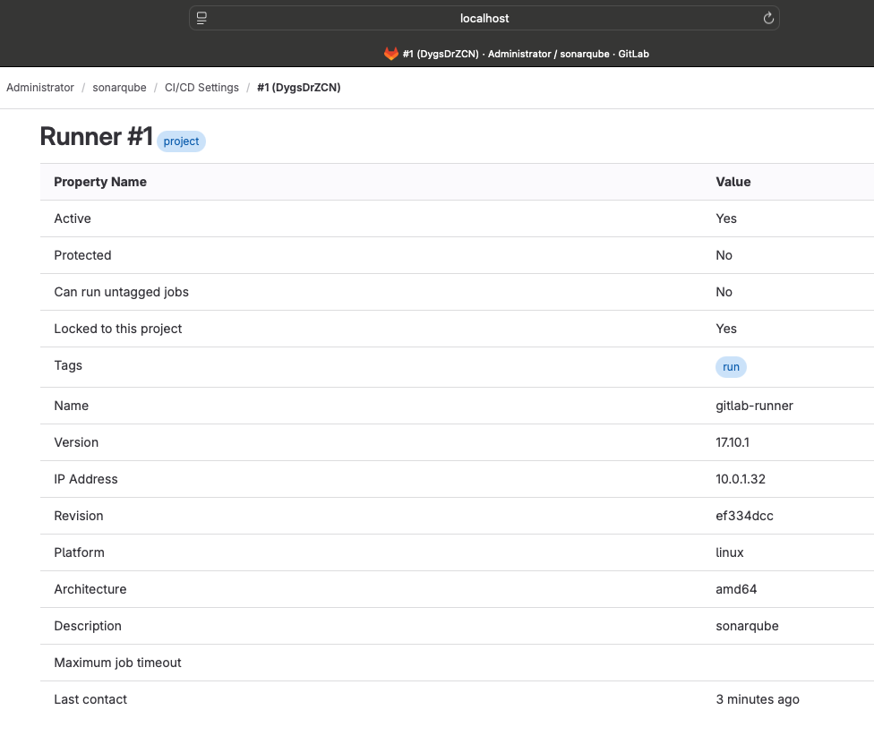
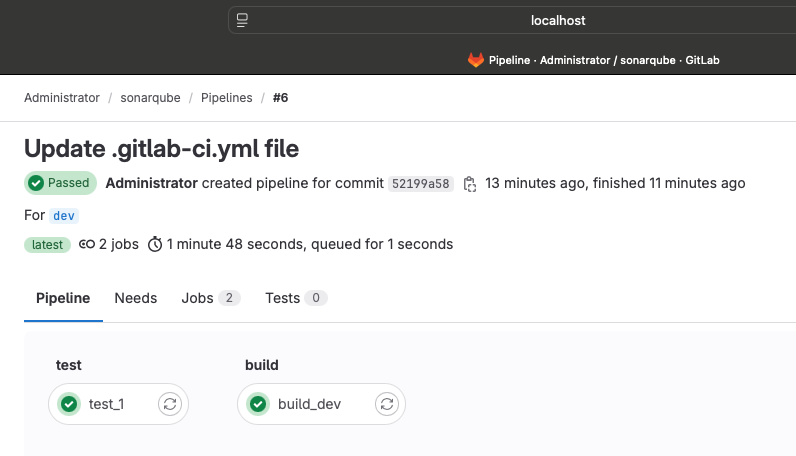
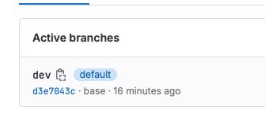

# Домашнее задание к занятию "GitLab" - Koshel Nikolay
   
### Задание 1

### Задание 2

----.gitlab-ci.yml
      stages:
      - test
      - build

      test_1:
      tags: 
         - run
      stage: test
      image: golang:1.17
      script: 
         - go test .
         - ls -la

      build_dev:
      tags: 
         - run
      stage: build
      image: docker:latest
      script:
         - docker build .

Успешная сборка

### Задание 3

----.gitlab-ci.yml

stages:
  - test
  - build

test_1:
  rules:
   - changes:  
      - ./*.go
  tags: 
    - run
  stage: test
  image: golang:1.17
  script: 
   - go test .
   - ls -la

build_dev:
  tags: 
    - run
  stage: build
  image: docker:latest
  script:
   - docker build .

[def]: image.png
[def2]: image-1.png